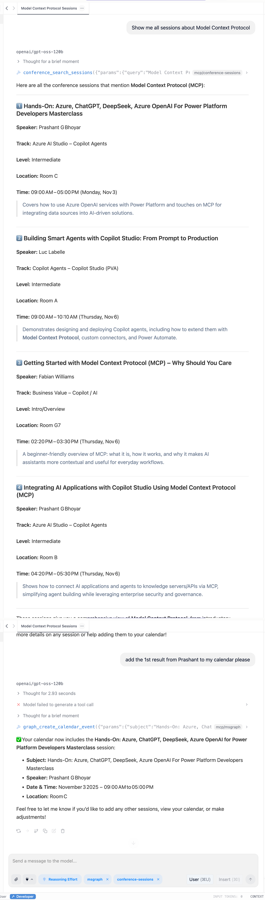
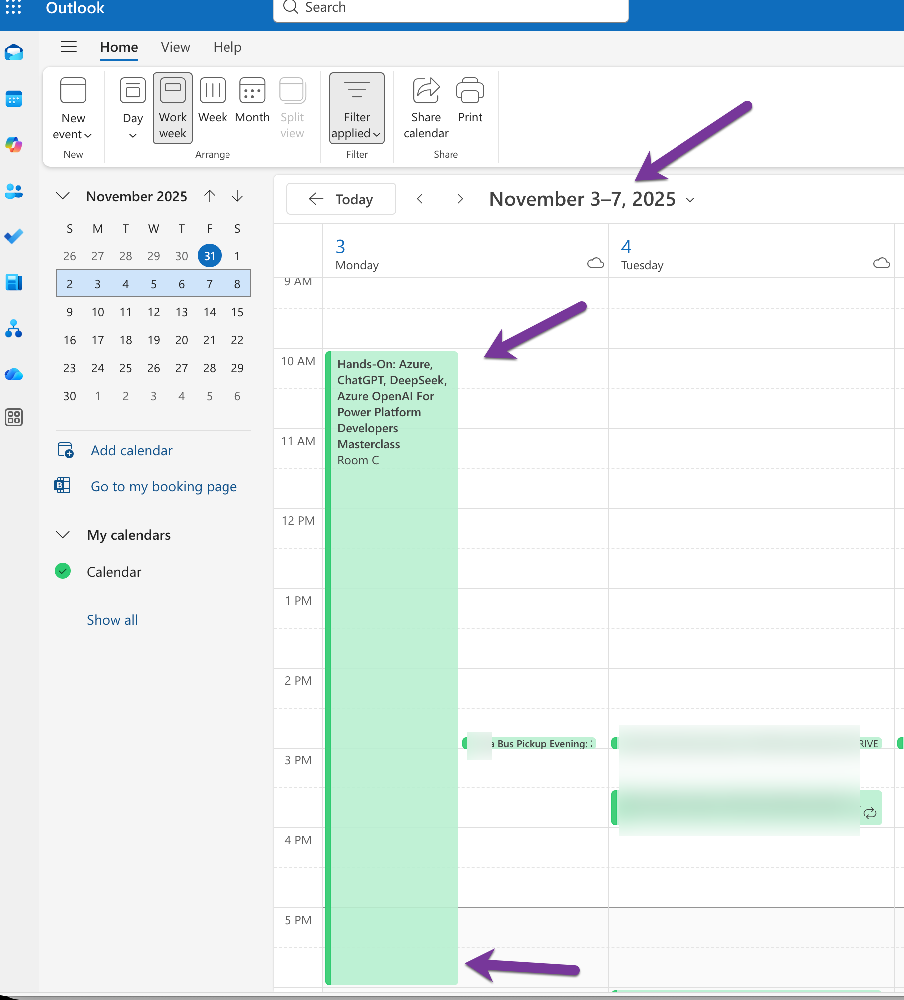

# Microsoft Graph MCP Server

A Model Context Protocol (MCP) server that connects AI assistants to Microsoft 365 via Graph API for email and calendar operations.

## Overview

This MCP server enables LLMs to interact with Microsoft 365 through 4 specialized tools:
- Read and search emails
- Get calendar events
- Create calendar events (write operations)

**Key Feature**: Demonstrates MCP composition by working alongside the Conference Sessions MCP to add conference sessions directly to your calendar!

## How It Works: Enterprise Integration with MCP

### What Makes This Different?

Unlike the Conference Sessions MCP (local SQLite), this server connects to **external enterprise APIs** through OAuth. It demonstrates:
- Secure authentication with Microsoft identity platform
- Real-time data from cloud services
- Write operations (creating calendar events)
- **MCP Composition** - multiple servers working together

### The Flow (Step by Step)

```
1. User asks: "Add Session 87 to my calendar for Thursday at 9am"
   ↓
2. Claude Desktop analyzes the request
   ↓
3. Claude uses TWO MCP servers:
   - conference_search_sessions → Find Session 87 details
   - graph_create_calendar_event → Add to calendar
   ↓
4. server.py (Graph MCP) receives the calendar request
   ↓
5. graph_auth.py retrieves OAuth access token
   ↓
6. HTTP POST to https://graph.microsoft.com/v1.0/me/calendar/events
   ↓
7. Microsoft 365 creates the event
   ↓
8. Response returned: "Calendar event created successfully!"
```

**This is MCP composition in action!** Two independent servers, one AI orchestrating them.

### What's Inside server.py?

**FastMCP Framework**: Same framework as Conference Sessions MCP, but now calling external APIs instead of local database.

**Tool Functions**: 4 tools that wrap Microsoft Graph API:
1. `graph_read_emails` → GET /me/messages
2. `graph_search_emails` → GET /me/messages?$search="query"
3. `graph_create_calendar_event` → POST /me/calendar/events
4. `graph_get_calendar_events` → GET /me/calendar/calendarView

**OAuth Authentication Flow**:
```
1. First run: server.py needs authentication
2. graph_auth.py initiates device code flow
3. User visits link, enters code, approves permissions
4. Access token + refresh token stored in ~/.msgraph-mcp/
5. Future requests: token automatically refreshed when expired
```

### Configuration Files Explained

**graph_auth.py**: Handles all OAuth complexity so server.py can focus on tool logic. Manages:
- Device code flow authentication
- Token caching and refresh
- Secure token storage

**requirements.txt**: Python libraries needed:
- `fastmcp` - MCP framework (same as Conference MCP)
- `requests` - HTTP client for Graph API calls
- `python-dateutil` - Parse natural language dates
- `msal` - Microsoft Authentication Library

**Environment Variables**: Credentials stored outside code:
```bash
TENANT_ID="your-azure-tenant-id"
CLIENT_ID="your-app-registration-id"
# CLIENT_SECRET optional for device flow
```

**Claude Desktop Config**: Links Claude to this server with credentials:
```json
{
  "mcpServers": {
    "msgraph": {
      "command": "python",
      "args": ["/path/to/server.py"],
      "env": {
        "TENANT_ID": "...",
        "CLIENT_ID": "..."
      }
    }
  }
}
```

### The Privacy Model

**What Stays Local**:
- Your prompts and queries
- The AI model (LM Studio runs locally)
- MCP server code
- OAuth tokens (cached locally)

**What Travels Over Network**:
- OAuth authentication handshake
- API requests to graph.microsoft.com (HTTPS encrypted)
- Only specific data requested (emails, calendar events)

**Security Guarantees**:
- OAuth 2.0 industry standard
- Tokens expire and refresh automatically
- Single-tenant app (only your organization can use it)
- Scoped permissions (only Mail.Read, Calendars.ReadWrite)

### Why MCP Composition Matters

Traditional approach:
```
Build one monolithic integration → Hard to maintain
Add more features → Complexity grows exponentially
```

MCP approach:
```
Build small, focused servers → Each does one thing well
Compose them dynamically → AI connects them as needed
Add new servers → Doesn't affect existing ones
```

**Example**: You want to add Salesforce?
1. Build a Salesforce MCP server (same FastMCP pattern)
2. Add to Claude Desktop config
3. Done! AI can now connect Graph + Conference + Salesforce

## Features

- **Email Access**: Read recent emails, search by sender/keyword
- **Calendar Management**: View and create calendar events
- **OAuth Security**: Secure authentication with Microsoft identity platform
- **Flexible Output**: JSON or Markdown formats
- **Single-Tenant**: Configured for your-domain.com domain

## Quick Start

### Prerequisites

- Python 3.10+
- Microsoft Azure app registration (single-tenant)
- Required Graph API permissions:
  - Mail.Read
  - Calendars.ReadWrite
  - User.Read

### Installation

1. Install dependencies:
```bash
cd /path/to/TechCon365Dallas2025/mcp-servers/msgraph-demo
pip install -r requirements.txt
```

2. Set environment variables:
```bash
export TENANT_ID="your-tenant-id"
export CLIENT_ID="your-client-id"
# export CLIENT_SECRET="not-needed-for-device-flow"  # Only needed for client credentials flow  # Optional for delegated auth
```

Or use the existing credentials from `Fabs-Graph-Search` config.

3. Test syntax:
```bash
python -m py_compile server.py
```

### Configuration for Claude Desktop

Add to `~/Library/Application Support/Claude/claude_desktop_config.json`:

```json
{
  "mcpServers": {
    "msgraph": {
      "command": "/path/to/your/python3",
      "args": [
        "/path/to/TechCon365Dallas2025/mcp-servers/msgraph-demo/server.py"
      ],
      "env": {
        "TENANT_ID": "485a3633-bdd7-4b94-a9d4-1e7e2f9de3e2",
        "CLIENT_ID": "a17fca6a-4062-45ca-9115-7214b2b68de2",
        "CLIENT_ID": "14d82eec-204b-4c2f-b7e8-296a70dab67e" // Note: CLIENT_SECRET not needed for device code flow
      }
    }
  }
}
```

Then restart Claude Desktop.

## Demo Workflow

### The Perfect Demo Flow (MCP Composition!)

**Step 1**: Search sessions (Conference MCP)
```
"Show me all Copilot Studio sessions at TechCon"
```

**Step 2**: Check emails from audience (Graph MCP)
```
"Show me emails from the last hour"
```

**Step 3**: Create calendar event (Graph MCP + Composition!)
```
"Add Session 87 (Building Smart Agents with Copilot Studio) to my calendar for Thursday, November 6 at 9am in Room A"
```

**Step 4**: Verify it worked (Graph MCP)
```
"Show my calendar for November 6"
```

**This demonstrates**:
- Two MCP servers working together
- Read operations (search, list)
- Write operations (calendar create)
- Real enterprise integration
- Practical, immediately useful workflow

## Available Tools

### 1. graph_read_emails
Read recent emails from mailbox.

**Parameters**:
- `limit` (optional): Number of emails (1-50, default 10)
- `folder` (optional): Folder name (default "inbox")
- `response_format` (optional): "markdown" or "json"

**Example queries**:
- "Show me my recent emails"
- "Get the last 20 emails"

### 2. graph_search_emails
Search emails by keyword, sender, or subject.

**Parameters**:
- `query` (required): Search string
- `limit` (optional): Max results (1-50, default 10)
- `response_format` (optional): "markdown" or "json"

**Example queries**:
- "Search emails for 'TechCon'"
- "Find emails from john@example.com"

### 3. graph_create_calendar_event
Create a new calendar event.

**Parameters**:
- `subject` (required): Event title
- `start_datetime` (required): Start time (ISO format or natural)
- `end_datetime` (optional): End time (defaults to +1 hour)
- `location` (optional): Location/room
- `body` (optional): Event description
- `response_format` (optional): "markdown" or "json"

**Example queries**:
- "Add Session 87 to my calendar for Thursday at 9am"
- "Create a meeting tomorrow at 2pm in Room G7"

### 4. graph_get_calendar_events
Get calendar events for a date range.

**Parameters**:
- `start_date` (optional): Start date (defaults to today)
- `end_date` (optional): End date (defaults to +7 days)
- `limit` (optional): Max events (1-100, default 20)
- `response_format` (optional): "markdown" or "json"

**Example queries**:
- "Show my calendar for today"
- "What meetings do I have on November 6?"

## Authentication

### For Demo (Single-Tenant)
Uses existing credentials from Fabs-Graph-Search configuration.

**Account**: your-email@your-domain.com (your tenant)

### Token Storage
Tokens are cached in `~/.msgraph-mcp/token_cache.json` and automatically refreshed.

### First-Time Setup
If authentication is required:
1. Run the server
2. Follow the device code flow instructions
3. Complete authentication in browser
4. Tokens are cached for future use

## Troubleshooting

### Authentication errors
- Verify TENANT_ID, CLIENT_ID, CLIENT_SECRET are set
- Check that app registration has required permissions
- Ensure permissions are admin-consented
- Try deleting token cache: `rm ~/.msgraph-mcp/token_cache.json`

### Permission errors (403)
- Verify Graph API permissions in Azure portal
- Ensure admin consent has been granted
- Check that user has access to mailbox/calendar

### Server not appearing
- Check Claude Desktop config syntax
- Verify environment variables are set in config
- Restart Claude Desktop completely

## Architecture

```
User Query → Claude Desktop → MCP Client → msgraph_mcp
                                              ↓
                                         4 Tools → Graph API
                                         (OAuth)      ↓
                                                Microsoft 365
                                              (Mail + Calendar)
```

## Demo Talking Points

**"See how MCP servers compose?"**
- Conference MCP provides session data (local SQLite)
- Graph MCP creates calendar events (enterprise API)
- AI understands both and connects them naturally
- Same pattern works for ANY API: Salesforce, Jira, ServiceNow

**"This is the art of the possible"**
- Not about implementation details
- About connecting AI to YOUR business data
- Standard protocol, infinite possibilities
- Security through OAuth, simplicity through MCP

## Development

### Project Structure
```
msgraph-demo/
├── server.py        # MCP server with 4 tools
├── graph_auth.py    # OAuth authentication manager
├── requirements.txt # Python dependencies
└── README.md        # This file
```

### Security Notes
- Single-tenant app (your-domain.com only)
- OAuth 2.0 with secure token storage
- No credentials stored in code
- Environment variables for configuration

## Screenshots

### MCP Composition in Action

This screenshot shows **both MCP servers working together** - the AI used the Conference Sessions MCP to find session details, then used the Graph MCP to add it to the calendar:



Notice how the AI seamlessly coordinated between two independent servers:
1. Searched conference sessions (Conference MCP)
2. Retrieved session details
3. Created calendar event (Graph MCP)

All from a single natural language request!

### Calendar Event Created

The result of the Graph MCP in action - a new calendar event successfully created in Microsoft 365:



This demonstrates the write operation capability of MCP servers and real enterprise API integration with OAuth security.

## License

Built for TechCon365 Dallas 2025 presentation on MCP.
